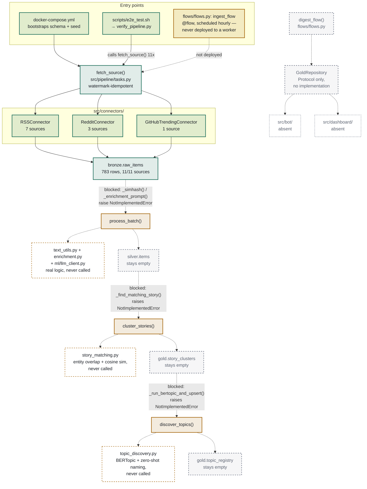

# Pipeline Overview — Entrypoints & Flow

**As of:** post Phase 1 ingestion validation (see `HANDOFF.md`)
**Scope:** what actually runs today, not what the design docs describe. Live
re-verified against a rebuilt Docker image and a real testcontainers
Postgres — not the design docs alone.

---

## Summary

Three entrypoints converge on `fetch_source()`, which fans out across three
connector classes into `bronze.raw_items` — the only stage that moves data
end to end (783 rows, 11/11 sources, verified live).

Everything past that point is **wired but stubbed**: `process_batch`,
`cluster_stories`, and `discover_topics` are real `@task`-decorated
functions that get called, and each one immediately hits a helper that
raises `NotImplementedError`. In every case, a working implementation of
that exact helper already exists in a sibling module — `text_utils.py`,
`story_matching.py`, `topic_discovery.py` — it's just never called from
`tasks.py`. Wiring these three call sites is the single highest-leverage
next step toward Phase 2.

Serving doesn't exist yet: `GoldRepository` is a `Protocol` with no Postgres
implementation, and `src/bot/` / `src/dashboard/` aren't there.

---

## Diagram

**Legend**
- **Live** (solid teal) — runs, tested, verified against a real Postgres.
- **Stub** (amber) — wired in, but the helper it calls raises `NotImplementedError`.
- **Orphaned implementation** (dashed amber) — the real code the stub needs already exists, unused, in a sibling module.
- **Schema, unreached** (dashed grey) — table exists, stays empty because nothing upstream reaches it.
- **Absent** (dotted grey) — no code at this path yet.

---

## Every stage, exact file

| Stage | Entry / task | File | Status |
|---|---|---|---|
| Bootstrap | `docker compose up` | `docker-compose.yml`, `sql/migrations/001_initial_schema.sql` | **live** |
| Manual verify | `verify_pipeline.py` | `scripts/verify_pipeline.py` | **live** |
| Scheduled ingest | `ingest_flow` | `flows/flows.py` | defined, not deployed to prefect-worker |
| Fetch | `fetch_source()` | `src/pipeline/tasks.py` | **live** |
| Connect | `RSSConnector` / `RedditConnector` / `GitHubTrendingConnector` | `src/connectors/{rss,reddit,github_trending}.py` | **live** |
| Process | `process_batch()` | `src/pipeline/tasks.py` calls stub; real code in `text_utils.py`, `enrichment.py`, `ml/llm_client.py` | stub |
| Cluster | `cluster_stories()` | `src/pipeline/tasks.py` calls stub; real code in `story_matching.py` | stub |
| Discover topics | `discover_topics()` | `src/pipeline/tasks.py` calls stub; real code in `topic_discovery.py` | stub |
| Serve | `digest_flow()`, `GoldRepository` | `flows/flows.py`, `src/gold/repository.py` | Protocol only, no implementation |
| Bot / Dashboard | — | `src/bot/`, `src/dashboard/` | directories don't exist |

---

## Related

- Interactive version (same content, rendered SVG): https://claude.ai/artifact/FPEVbkEiQrdpehBQEZPKQM
- `docs/HANDOFF.md` — what Phase 1 covers and the team handover notes
- `docs/phase1-technical-design.md` §8 — the full Phase 1 MVP checklist (broader scope than what's implemented so far)
